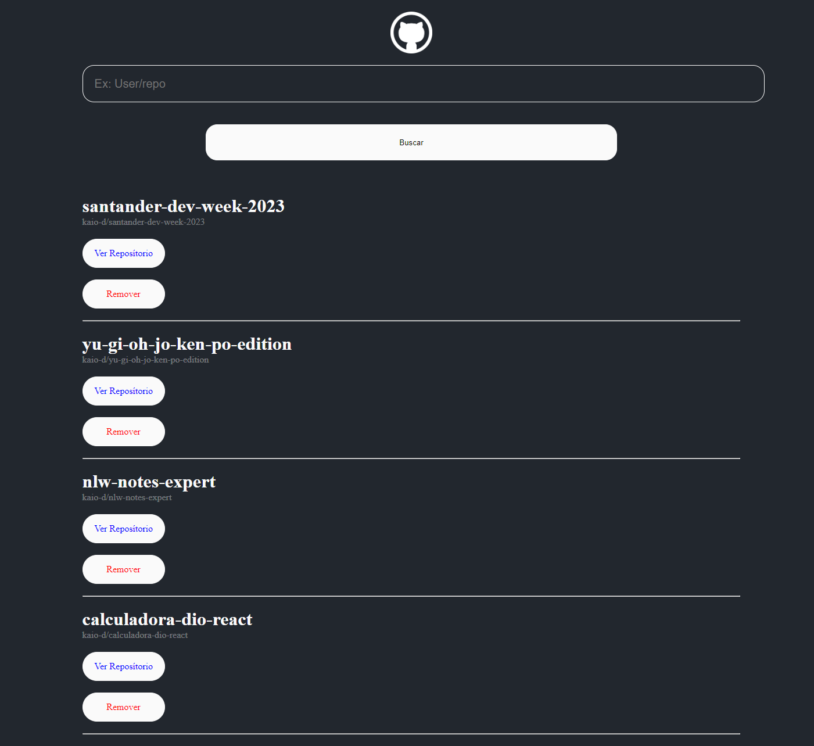

<h1 align="center">GitWiki - Trilha React </h1>

O projeto consite na construção de uma aplicação Web, na qual utilizando a API do GiHub informamos o nome de usuário e determinado repositória na qual o mesmo será listado.</a>.

## Súmario

- [📦 Temas abordados](#topics)
- [🏆 Sobre](#sobre)

<h2 id="features">✨ Features </h2>

- React
- HTML
- CSS
- JavaScript

<h2 id="sobre">🏆 Sobre</h2>

Como desafio criamos uma aplicação que busca dados utilizando a API do GitHub.
